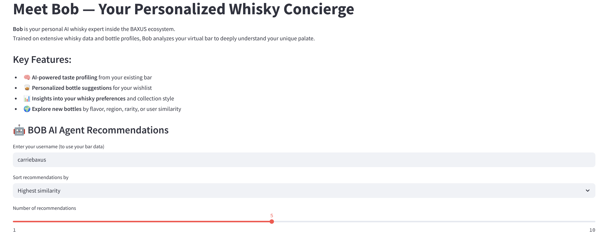
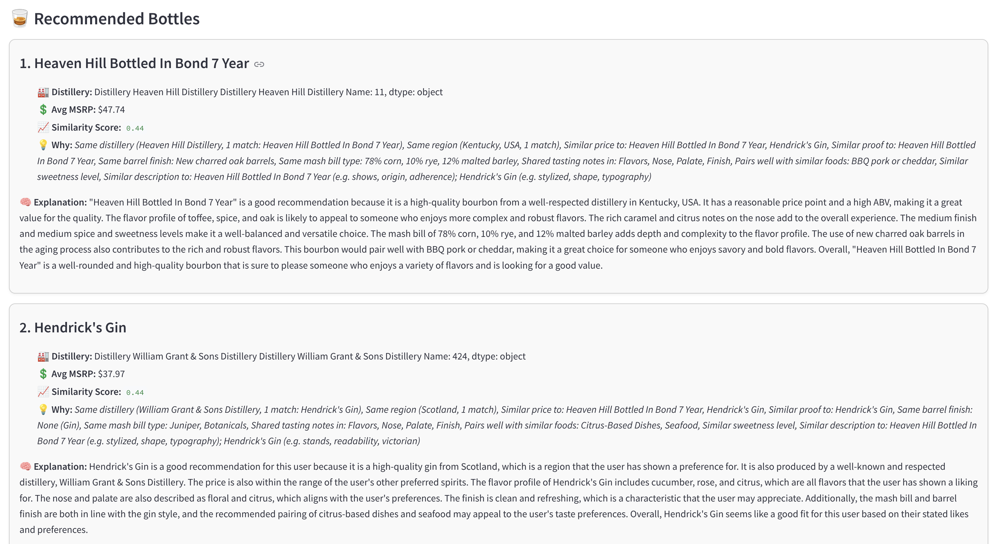

# AI Whisky Recommender - README

## Overview

The **AI Whisky Recommender** is a Streamlit-based application that utilizes AI to provide personalized whisky recommendations. By leveraging extensive whisky data and user preferences, it offers insightful bottle suggestions for your collection, explores new bottles by flavor, region, rarity, and user similarity, and explains why a particular whisky is recommended based on your tastes.

### Features:
- 🧠 **AI-powered taste profiling** from your existing whisky collection  
- 🥃 **Personalized bottle suggestions** for your wishlist  
- 📊 **Insights into your whisky preferences** and collection style  
- 🌍 **Explore new bottles** based on flavor, region, rarity, or user similarity  

## Installation

To run the AI Whisky Recommender, follow these steps:

1. **Clone the repository**  
   Clone the repository to your local machine.

   ```bash
   git clone https://github.com/Isaacgv/ai-agent.git
   ```

2. **Install dependencies**  
   Navigate to the project directory and install the required packages using `pip`.

   ```bash
   cd ai-whisky-recommender
   pip install -r requirements.txt
   ```

3. **Set up your environment**  
   Create a `.env` file and add your OpenAI API key:

   ```plaintext
   OPENAI_API_KEY=your_openai_api_key
   ```

4. **Run the app**  
   Launch the application using Streamlit.

   ```bash
   streamlit run agent.py
   ```

   The app should now be available in your browser at `http://localhost:8501`.

## How It Works

### Example Workflow:
1. **Fetch Your Collection:**  
   After entering your username, the app fetches your whisky collection from the BAXUS API.

   

2. **Analyze Your Collection:**  
   The system analyzes your whisky collection and compares it with the broader whisky dataset.

3. **Display Recommendations:**  
   The app presents personalized whisky recommendations sorted by criteria like similarity, price, or distillery.

4. **Explanation Generation:**  
   For each recommendation, an AI-generated explanation is provided, detailing why the whisky is a good match for your collection.

   

## Video Demo
   [Watch tthe video demo on YouTube](https://www.youtube.com/watch?v=rhJJGcgkI5M)

---

Enjoy discovering new whiskies and enhancing your collection with **Bob** — your AI-powered whisky concierge! 🥃
